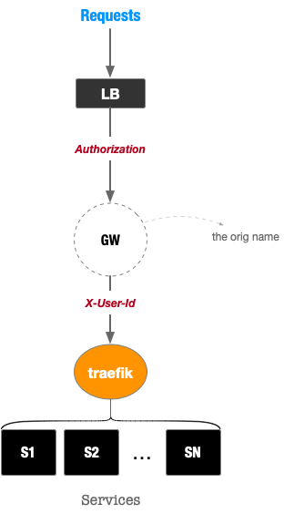
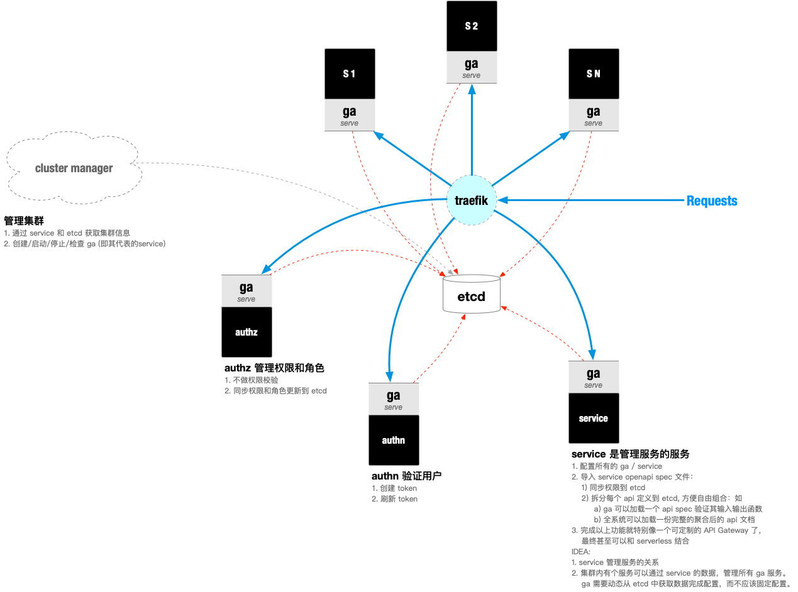

# **G** uardian **A** ngel

A lightweight middleware for service-oriented architecture

## 简介

ga 是一个缩写，可以有多种含义：
1. **G**uardian **A**ngel (守护神)
2. **G**eneral **A**gent (总代)

## 起因

### 现象和需求

在众包项目开发过程中，我们从 **微服务架构** 尝试到 **基于服务的架构** 转变，其中遇到这么几个问题：

1. 每个 **（微）服务** 的开发人员，都需要处理一些通用需求，如：
   - JWT (access_token) 的校验，解开 payload，获取 uid (用户ID)
   - 对于请求的 uid 进行鉴定权限
   - 对于请求参数作校验
   - 对于返回参数作校验（通常 testcase 需要处理）
   - 安全地访问其他服务（需要验证和鉴权）
   - `...`

2. 每个服务可能会使用不同的语言来开发，就会出现：
   - 每种语言需要处理一遍上面的需求
   - （即便同种语言）每个人（看大家愿不愿意用上一个人的开发库）可能也会自己实现一遍上面的需求
   - `...`

3. 服务隔离，如何保障每个服务除了 ga ，不能直接访问其他服务。

### 研究和实践

最开始，我研究了下（持续1个多月时间）这些 API Gateway / Reverse Proxy （关于它们不能很好处理这个问题的说明，以后补充）：

- kong
- traefik
- vulcand

### 尝试和思考

后来，我实现了一个名为 `gw` 的服务（持续1小时）。只是简单地将 HTTP Request Header 里的 `Authorization` （JWT）验证一下（使用公钥），并解开 payload 里的 uid ，作为 HTTP Reuqest Header 的 `X-User-Id` 传递给 `traefik` ，直至最终的服务。如下图：

但是，后来思考了一下，有这么几个原因促使我重新定义一下这个服务（`gw`）：
1. 还有很多问题也可以通过这个通用服务 (`gw`) 来解决
2. 我们已经使用 SwaggerUI 2.0 标准定义的各个服务的接口文档。且部分 cswork 的服务接口已经通过该服务自身的 SwaggerUI 文档来验证 Request 和 Response 参数
3. 如果把 SwaggerUI 里的接口定义和当前 HTTP Request 的 Method + Path + uid 等信息结合起来，我们可以实现一个通用的 RBAC 权限校验架构，适配所有类型的服务开发
4. 服务隔离

### 当前设计

最终，改名为 `ga` ，准备加入其他通用需求，目前，设想架构如下：

## 目录

- [ideas](./docs/ideas.md)
- [istio](./docs/istio.md)
