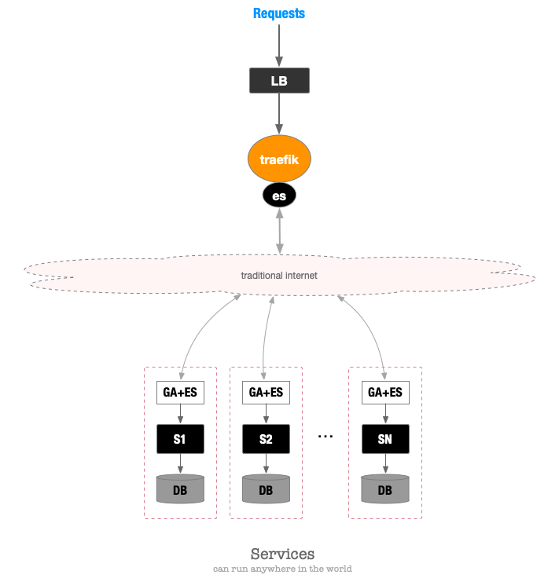

# Add ES

[es](https://github.com/ooclab/es) 是我们开发的一个对等 tunnel 协议（ 测试请使用 [otunnel](https://github.com/ooclab/otunnel) ）。
ga 如果搭建 es ，可以做到将分布式的、使用传统协议开发的服务聚合成虚拟服务池。

用途：

1. 开发测试使用，可以让任何网络环境（只要能够访问 traefik 外网）中服务，可以方便地对接上来。
2. 特殊服务的部署更加自由。
