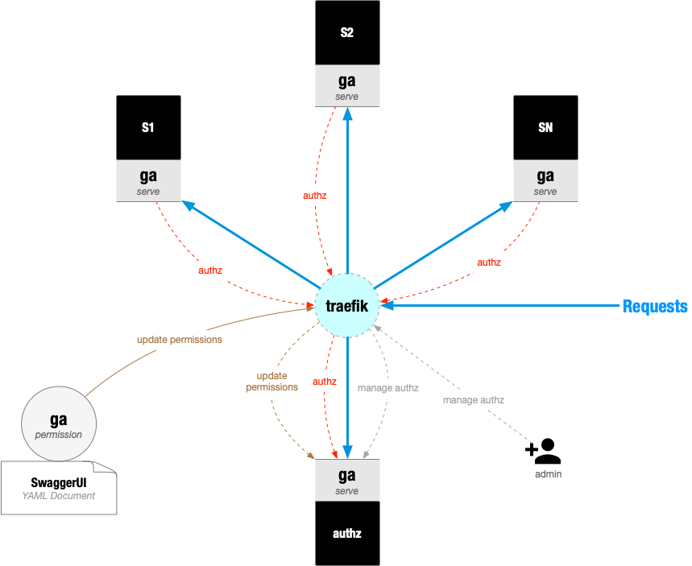

# AuthZ

ga 环境中 authz 架构图如下：



1. 管理员（admin）运行初始化程序（`ga permission`）调用 `authz` 服务提供的接口更新权限。
2. authz 和 authn 分开，这样有利于 authz 功能更内聚。


## 权限名称

以 SwaggerUI 文档的关键值组成，全部字符串使用 **小写**：

1. Service Name : 本服务的名称，如 `authz`
2. Method : 请求方法，如 `get`, `post`, `put`, `delete`, `head` 等
3. Path : 如 `/user/{id}`

最终组成的权限名称字符串示例如下：

```
authz:get:/role/{id}
authz:post:/role/{id}
authz:delete:/role/{id}
authz:get:/permission/{id}
authz:post:/permission/{id}
authz:delete:/permission/{id}
```

TODO:
1. 权限名中的 `Service Name` 可以考虑使用 SwaggerUI YAML 文档中的某个值为默认值
