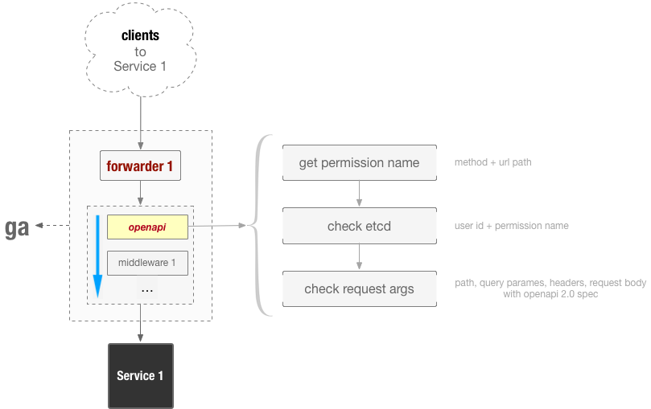

# openapi middleware

`openapi` middleware 处理所有请求的权限和参数。

用途：

1. 外部服务访问内部服务，需要校验其是否有相应的权限时，此 middleware 可以根据 OpenAPI Spec 文档（目前支持 SwaggerUI 2.0）校验其权限和参数。

流程：



1. 启动 forwarder 监听端口（如 `2999`），接受外部请求
1. 加载 openapi middleware （读取后端服务的 OpenAPI 2.0 Spec 文档）
2. 根据当前请求 Method, URL 匹配权限名称，查询 etcd 记录，决定当前用户是否有权限访问该接口 （ etcd 权限配置由 [authz](https://github.com/ooclab/ga.authz) 管理和维护 ）
3. 如果通过权限校验，则继续校验请求参数是否准确
4. 如果以上都通过，转发 HTTP Request 到后端真正的服务

说明：

1. [authz](https://github.com/ooclab/ga.authz) 是我们设计的一种权限管理服务，实际环境中，可以修改代码，实现自定义的权限管理。


## 功能

- \[x] validate service's openapi 2.0 spec document
- \[x] match http request route to permission name
- \[x] Dose the current X-User-Id has this permission ( current request entry ) , use etcd
- \[ ] validate request args


## 使用

### 禁止未声明的参数

在 json schema 里设置 `additionalProperties: false` 即可，示例：

```yaml
post:
  tags:
  - permission
  summary: 创建权限
  x-roles:
  - admin
  - create-permission
  parameters:
  - name: body
    in: body
    schema:
      type: object
      required:
      - name
      additionalProperties: false
      properties:
        name:
          type: string
          description: 名称（必须全局唯一）
          minLength: 2
          maxLength: 128
        summary:
          type: string
          description: 描述
          maxLength: 256
        description:
          type: string
          description: 详细描述
  responses:
    "200":
      description: OK
      schema:
        $ref: '#/definitions/ObjectCreateSuccess'
    default:
      description: |
        返回错误信息
        error 值及含义：
        - `name-exist` : 名字已经存在
      schema:
        $ref: '#/definitions/DefaultErrorResponse'
```


## 参考

- [openapis.org](https://www.openapis.org/)
- [swagger.io](https://swagger.io/)
- [OpenAPI-Specification](https://github.com/OAI/OpenAPI-Specification)
- [go-openapi](https://github.com/go-openapi)
